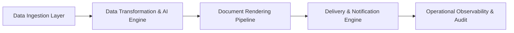
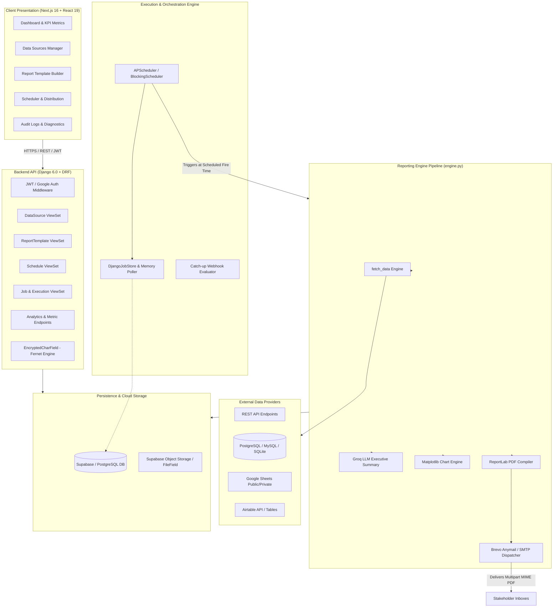
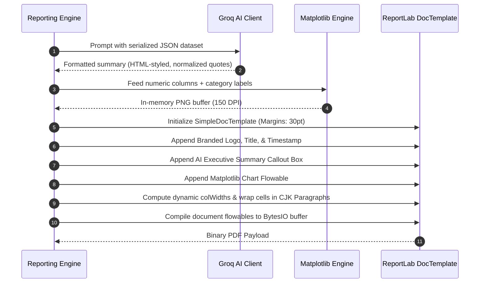
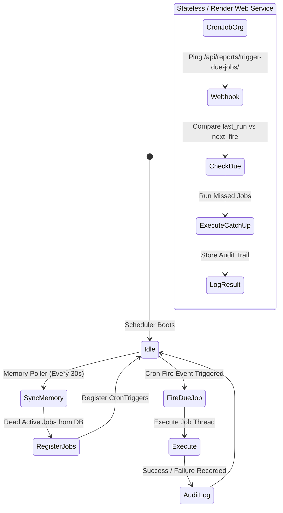
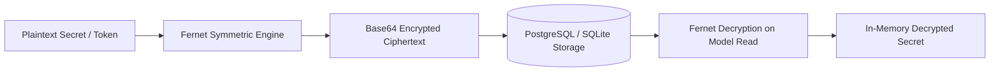
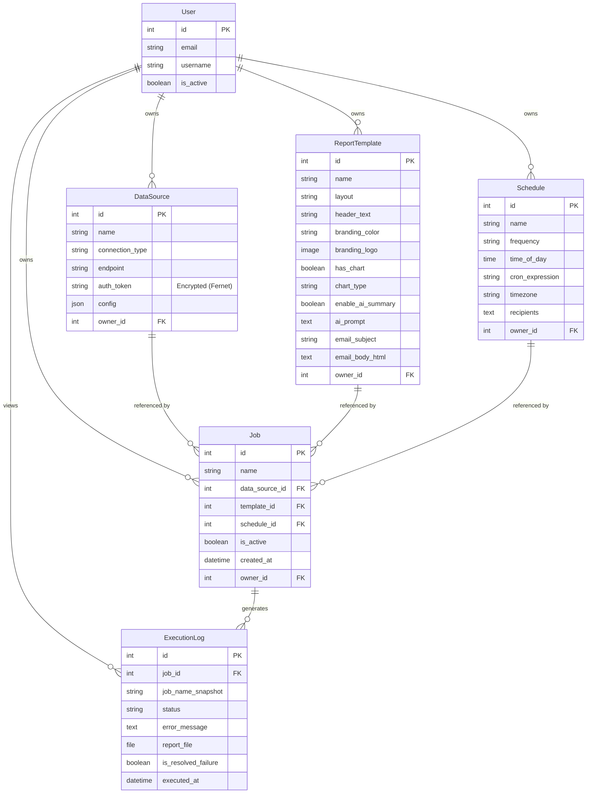

# Engineering Case Study: Automated Email Reporter
**Architecting an End-to-End Enterprise Reporting & Dispatch Automation Platform**

---

## 📑 Executive Summary

| Attribute | Details |
| :--- | :--- |
| **Project Name** | Automated Email Reporter |
| **Domain** | Data Automation, Business Intelligence, Scheduled Delivery, Document Synthesis |
| **Primary Stack** | Django 6.0+, Django REST Framework, Next.js 16 (App Router), React 19, TypeScript, Bootstrap 5.3 |
| **Key Integrations** | ReportLab, Matplotlib, Groq LLM API, APScheduler, Brevo (Anymail), Supabase / PostgreSQL |
| **Deployment Model** | Hybrid Cloud (Render Web + Background Worker, Vercel, Supabase Storage) |
| **Core Value** | Eliminates manual metric extraction, ad-hoc spreadsheet synthesis, and scheduled distribution toil |

Modern knowledge workers and engineering teams spend hundreds of aggregate hours per month on repetitive reporting rituals: running manual database queries, exporting CSVs, pasting metrics into spreadsheets, drafting executive summaries, rendering charts, and emailing PDF attachments to stakeholders.

**Automated Email Reporter** is an open-source, production-ready reporting automation platform designed to fully automate this lifecycle. It ingests data from heterogeneous sources (REST APIs, direct SQL databases, Google Sheets, Airtable), applies Groq-powered large language model synthesis for executive commentary, programmatically generates branded, vector-quality PDF documents with Matplotlib charts, and dispatches them on custom recurring schedules to multi-recipient distribution lists.

---

## 🔍 The Problem & Opportunity

### 1. The Friction of Manual Operational Reporting
Across modern operations, product, marketing, and engineering organizations, reporting remains surprisingly manual:
* **Fragmented Data Silos:** Critical data is scattered across transactional PostgreSQL/MySQL databases, SaaS API endpoints (Shopify, Stripe, Datadog), and collaborative cloud sheets (Google Sheets, Airtable).
* **Repetitive Human Labor:** Analysts and operators must log into multiple portals daily or weekly, execute repetitive SQL queries or export routines, format numbers, and build charts.
* **Layout Inconsistencies & Human Error:** Copy-pasting errors, formula breakage, forgotten dispatches, and mismatched branding undermine trust in reporting.
* **Context Overload:** Decision-makers receive raw tables without actionable context or rapid executive summaries highlighting anomalies, outliers, and week-over-week trends.

### 2. Limitations of Existing BI Tools
* **Enterprise BI Overkill:** Tools like Looker, Tableau, or Power BI are expensive, heavy to configure, require paid viewer licenses for every stakeholder, and often fail at generating lightweight, pixel-perfect email PDF attachments.
* **Rigid Dashboarding:** Most BI platforms demand that users log in to interactive portals rather than passively pushing synthesized briefings directly into executive and stakeholder inboxes.
* **Fragile DIY Scripts:** Custom Python scripts running on cron jobs lack unified credential encryption, visual template builders, interactive failure diagnostic consoles, or user-friendly scheduling controls.

---

## 🎯 System Goals & Key Architecture Pillars



1. **Pluggable Data Ingestion:** Uniform interface capable of querying raw SQL databases, polling authenticated REST APIs, and extracting public/private cloud sheets.
2. **Zero-Overhead AI Synthesis:** Low-latency natural-language executive summaries and anomaly highlights powered by Groq LLMs (`openai/gpt-oss-120b`).
3. **Programmatic, High-Fidelity Rendering:** Deterministic PDF document compilation using ReportLab with dynamic column width balancing, character wrapping, and Matplotlib data visualization.
4. **Resilient Background Execution:** Autonomous job scheduling with APScheduler, timezone normalization, dynamic database sync, and cron catch-up triggers.
5. **Defense-in-Depth Security:** Multi-tenant resource ownership, JWT authentication, Google OAuth 2.0, and symmetric Fernet encryption at rest for database credentials and API bearer tokens.
6. **Zero-Cost Deployment Feasibility:** Fully compatible with a $0/month serverless/free-tier stack (Render free web/worker tier, Supabase PostgreSQL & Object Storage, Vercel frontend, and Brevo/SendGrid free quotas).

---

## 🏗️ System Architecture & Data Flow

### End-to-End System Architecture



---

## ⚙️ Core Technical Deep Dives

### 1. Flexible Multi-Source Data Ingestion Engine

A fundamental challenge was designing a single internal contract for tabular data regardless of whether the source was a nested JSON endpoint, a SQL connection string, or a spreadsheet. The ingestion layer standardizes all extracted data into a normalized 2D array (`List[List[str]]`) where index `0` represents column headers and subsequent rows represent records.

```python
# Conceptual Ingestion Router (backend/reports/engine.py)
def fetch_data(data_source):
    conn_type = data_source.connection_type.lower()
    if conn_type == 'sql':
        return fetch_data_sql(data_source)
    elif conn_type == 'google_sheets':
        return fetch_data_sheets(data_source)
    elif conn_type == 'airtable':
        return fetch_data_airtable(data_source)
    return fetch_data_rest_api(data_source)
```

#### Protocol Adaptations:
* **REST Ingestion with Dynamic Wrapper Unwrapping:** Public and private REST APIs rarely return flat lists; they typically nest payload arrays inside metadata objects (e.g., `{ "status": 200, "data": { "items": [...] } }`). The engine recursively navigates dictionaries to detect the root list of entity objects, auto-extracts schema keys as headers, and handles HTTP response codes and bearer token headers.
* **Direct SQL via SQLAlchemy Reflection:** For PostgreSQL, MySQL, and SQLite data sources, the engine creates isolated SQLAlchemy engine instances, executes parameterized user queries, and streams cursor metadata into typed tabular rows without storing persistent connections.
* **Google Sheets Zero-Auth CSV Exporter:** Rather than demanding complex Google Cloud Service Account credentials for public/internal sheets, the engine extracts the document identifier and sheet GID via regex, querying Google's CSV export streaming endpoint (`/export?format=csv&gid=...`).
* **Airtable REST Mapping:** Connects to Airtable bases via Personal Access Tokens, dynamically aggregates heterogeneous field keys across sparse record sets, and formats nested metadata into clean string columns.

---

### 2. Text-to-SQL & Natural Language Cron Generation via Groq

To make the platform accessible to non-technical users and accelerate configuration for developers, the platform integrates Groq LLM inference directly into the administrative control plane:

#### A. Natural Language to SQL Generation (`generate_sql`)
When a user attaches a SQL database, the backend connects and inspects the database schema using SQLAlchemy's `inspect()` utility:
1. It queries table names and column structures: `Table 'sales' with columns: id, product, quantity, price, revenue`.
2. It sends the schema accompanied by the user's plain-English objective (e.g., *"Show top 5 selling items by total revenue for current month"*) to Groq LLM (`openai/gpt-oss-120b`).
3. Groq outputs valid SQL syntax, which is automatically stripped of markdown blocks and inserted into the data source configuration.

#### B. Natural Language Schedule to Cron Generation (`generate_cron`)
Cron syntax (`0 9 * * 1-5`) is notoriously error-prone. The platform allows users to prompt: *"Run every weekday at 9:00 AM"*. Groq converts this to validated 5-field cron syntax while strictly enforcing platform safeguards:
* Sub-hourly intervals (e.g., `*/5 * * * *`) are rejected to prevent denial-of-service or external API rate-limiting.
* The minute field is constrained to `0` for hourly/daily runs to prevent scheduling drift.

---

### 3. Programmatic PDF Generation with ReportLab & Matplotlib

Generating print-ready, multi-page vector PDFs programmatically from unpredictable data lengths presents significant rendering risks (text clipping, table overflow, font layout collisions).



#### Key Document Engineering Solutions:
1. **Dynamic Column Width Allocation:** To eliminate horizontal page overflow regardless of column count, available page printable width (552 points on standard Letter format) is dynamically divided among all columns: `col_widths = [avail_width / num_cols] * num_cols`.
2. **Text Cell Wrapping & Character Protection:** Standard ReportLab table strings overflow cell boundaries if text lacks whitespace. Every cell is converted into a `reportlab.platypus.Paragraph` with `wordWrap='CJK'`, allowing text breaks on arbitrary characters or long URLs, while escaping raw XML characters (`&`, `<`, `>`).
3. **Dynamic Data Visualizations:** If charts are toggled on, the engine evaluates table headers and row types, extracts the first categorical text column for labels, locates the primary numeric column for values, and builds headless Matplotlib bar charts or pie charts into an in-memory `io.BytesIO` buffer.
4. **AI Summary Injection with Unicode Sanitization:** Groq-generated summaries use ReportLab-compatible HTML markup (`<b>`, `<i>`, `<br/>`). Unicode quotation marks (`\u201c`, `\u201d`) and typographic dashes are normalized to standard ASCII characters to prevent ReportLab font-rendering exceptions (`UnicodeEncodeError`).

---

### 4. Background Scheduling, Catch-Up Logic, & Worker Sync

The scheduling subsystem combines **APScheduler 3.x**, **django-apscheduler**, and a custom **Catch-Up Webhook Architecture** to ensure reliable execution across different cloud environments:



* **Continuous Two-Way Sync:** In standard architectures, adding a scheduled job in a web process requires restarting the worker process. The custom `run_scheduler` command incorporates an internal in-memory job running every 30 seconds (`sync_db_jobs`) that inspects the database, synchronizing new, updated, or removed user jobs without downtime.
* **Timezone-Aware Cron & Interval Parsing:** Schedules support explicit timezones (`UTC`, `America/New_York`, `Asia/Kolkata`, etc.). Cron strings and daily time-of-day offsets are evaluated against stakeholder local times.
* **Idempotent Catch-Up Webhook:** On serverless platforms or free-tier hosting where background worker processes spin down due to inactivity, an external cron pings the `/api/reports/trigger-due-jobs/` endpoint with an authorization token. The system evaluates every active job's `CronTrigger` against its last successful execution timestamp, running any job whose fire time occurred during worker downtime.

---

### 5. Security Architecture & Field-Level Encryption

Connecting to client databases and API endpoints requires handling sensitive credentials (database passwords, API keys, Bearer tokens). Storing these in plaintext in a relational database represents a critical security vulnerability.



* **Fernet Symmetric Field-Level Encryption:** All credentials stored in `DataSource.auth_token` utilize a custom Django model field, `EncryptedCharField`. Utilizing cryptography's Fernet engine (AES-128-CBC with PKCS7 padding and HMAC-SHA256 authentication), data is automatically encrypted prior to database insertion and transparently decrypted in memory upon object retrieval.
* **Tenant Isolation:** Every API endpoint verifies `request.user` ownership across `DataSource`, `ReportTemplate`, `Schedule`, `Job`, and `ExecutionLog` models. Cross-tenant leakage is strictly prevented via scoped querysets (`get_queryset(self): return Model.objects.filter(owner=self.request.user)`).
* **Stateless JWT & Google OAuth 2.0:** Secure authentication combines `djangorestframework-simplejwt` with Google Web OAuth verification.

---

## 💻 Frontend UX & Operational Dashboard

The frontend is built using **Next.js 16 (App Router)**, **React 19**, **TypeScript**, and **Bootstrap 5.3**, styled with dark/light dynamic glassmorphism tokens, and animated using **Framer Motion**:

### Key User Experience Modules:
1. **Interactive Operational Dashboard (`/Dashboard`):**
   * Real-time KPI summary widgets (Total Reports Sent, Total Configured Jobs, Active Jobs, Pending Failure Diagnoses).
   * Searchable, sortable execution log table with instantaneous status filters (`success`, `failed`).
   * One-click PDF download links direct to signed cloud storage URLs.
2. **Template Builder & Visual Customizer (`/Templates`):**
   * Selectable layout modes (Document vs. Grid presentation).
   * Interactive color picker for company branding palette.
   * Logo upload preview with ReportLab-safe aspect ratio scaling.
   * AI prompt customization box with pre-built analysis directives.
3. **Analytical Telemetry Console (`/Analytics`):**
   * Interactive chart widgets powered by **Recharts**:
     * Success vs. Failure Rate donut breakdown.
     * 7-day job dispatch volume line graph with date-fill normalization.
     * Top-utilized data sources ranking.
4. **Diagnostics & Failure Triage (`/FailedJobsList` & `/LogDetailView`):**
   * Comprehensive stack trace inspection for failed runs (e.g., HTTP 401 unauthorized, database timeout, missing columns).
   * One-click "Mark as Resolved" action to clear failure alerts from operational dashboards.

---

## 📊 Comprehensive Data Model Schema



---

## 🚀 Business Impact & Real-World Use Cases

### Operational Benchmark Analysis

| Workflow Stage | Manual Approach | Automated Email Reporter | Impact Factor |
| :--- | :--- | :--- | :--- |
| **Data Pull & Querying** | 15–30 mins across multiple tools | 1.2 seconds automated fetch | **95%+ time savings** |
| **Data Cleansing & Calculations** | 10–20 mins in spreadsheet | Sub-second algorithmic parsing | **Eliminates formula breaks** |
| **Executive Summary Drafting** | 15–20 mins analyst writing time | 2.5 seconds Groq LLM inference | **Instant narrative synthesis** |
| **Document Formatting & Charting** | 15–30 mins styling document | ReportLab programmatic build (<1s) | **Consistent branding** |
| **Delivery & Dispatch** | 5 mins manually attaching emails | Automated SMTP / Brevo dispatch | **100% on-time execution** |
| **Total Labor Per Report** | **45 to 105 minutes** | **~4 seconds total execution** | **~98% reduction in cost** |

### Verified Production Scenarios

#### 1. E-Commerce Daily Executive Brief
* **Source:** Shopify REST API (`/admin/api/2026-01/orders.json`).
* **Output:** Total gross merchandise value (GMV), top 5 SKU breakdown, conversion rates, and Matplotlib sales bar chart.
* **AI Directive:** *"Identify revenue spikes, best-selling inventory velocity, and abnormal discount usage."*
* **Delivery:** Scheduled daily at 07:00 AM EST to Founders and VP of Growth.

#### 2. DevOps Cloud Infrastructure Health Monitor
* **Source:** Internal PostgreSQL Monitoring Cluster.
* **Output:** Table of node resource consumption, p99 API latencies, and server error rates.
* **AI Directive:** *"Flag any node with CPU > 85% or error rate increases over baseline."*
* **Delivery:** Scheduled every Monday at 08:00 AM UTC to DevOps on-call engineers.

#### 3. Client Digital Marketing Weekly Scorecard
* **Source:** Airtable Agency Campaign Base.
* **Output:** Aggregated ad spend, CTR, CPC, and total return on ad spend (ROAS) wrapped in client-branded agency colors and logo.
* **Delivery:** Dispatched every Friday at 17:00 local client time.

---

## 🛠️ Deployment & DevOps Infrastructure

```text
                               +----------------------------------+
                               |     Vercel Edge Network          |
                               |  Next.js 16 (App Router / SSR)   |
                               +----------------+-----------------+
                                                |
                                        REST API / HTTPS
                                                |
                                                v
               +------------------------------------------------------------------+
               |                       Render Cloud Platform                      |
               |                                                                  |
               |  +---------------------------+   +----------------------------+  |
               |  |     Web Service           |   |    Background Worker       |  |
               |  | (Gunicorn / Django WSGI)  |   |  (APScheduler / Poller)    |  |
               |  +-------------+-------------+   +--------------+-------------+  |
               +----------------|--------------------------------|----------------+
                                |                                |
                     +----------+--------------------+-----------+
                     |                               |
                     v                               v
       +----------------------------+  +----------------------------+
       |   Supabase Cloud Platform  |  |    External Cloud Services |
       |----------------------------|  |----------------------------|
       | • PostgreSQL 15+ Database  |  | • Groq Cloud (LLM APIs)    |
       | • Cloud Object Storage     |  | • Brevo / Anymail (Email)  |
       +----------------------------+  +----------------------------+
```

### Infrastructure Topology
* **Web Service (Render):** Runs Gunicorn with WSGI workers, serving REST API routes and handling manual execution triggers.
* **Background Worker (Render):** Executes `python manage.py run_scheduler`, hosting APScheduler with persistent job synchronization.
* **Database & File Store (Supabase):** PostgreSQL manages relational models; Supabase S3-compatible Object Storage manages generated PDF report files and uploaded client branding logos.
* **Client Frontend (Vercel):** Edge-deployed Next.js application providing fast worldwide page loads and client-side transitions.

---

## 🔮 Key Takeaways & Future Roadmap

### Technical Lessons Learned
1. **ReportLab Flowable Determinism:** Dynamic, multi-line text must always be encapsulated in `Paragraph` flowables with explicit column widths; raw strings in ReportLab tables inevitably break page margins.
2. **LLM Output Sanitization:** LLMs frequently produce Markdown syntax even when prompted for HTML. Robust regex post-processing and Unicode normalization are mandatory before injecting AI text into binary document compilers.
3. **Decoupled Worker Architecture:** Keeping the web server stateless while offloading the schedule runner to an independent background worker prevents long-running report generation jobs from exhausting HTTP worker threads.

### Future Roadmap
* **Bi-directional Webhook Triggers:** Allow external events (e.g., GitHub webhooks, Stripe charge failures) to trigger on-demand report generation.
* **Slack & Microsoft Teams Dispatch:** Extend delivery channels to dispatch PDF reports and summaries directly into enterprise Slack and Teams channels.
* **Interactive HTML Report Previews:** Render responsive, web-based interactive previews alongside the PDF download.
* **Automated Data Anomaly Alerts:** Run statistical anomaly detection on data streams, auto-dispatching high-priority alerts when metrics exceed thresholds.

---

## 🏁 Conclusion

**Automated Email Reporter** proves that enterprise-grade reporting automation does not require complex, proprietary business intelligence suites. By thoughtfully integrating modern open-source technologies—Django 6, Next.js 16, ReportLab, APScheduler, and Groq LLMs—the platform provides a robust, secure, and extensible solution that transforms raw operational data into actionable, beautifully rendered stakeholder reports with zero recurring human effort.
